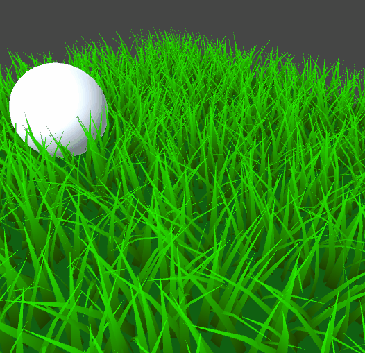

# Unity-GrassShader

The grass shader based on the awesome article by Roystan: https://roystan.net/articles/grass-shader.html

The repo contains the modified shader that adds grass interaction with objects in a scene.

